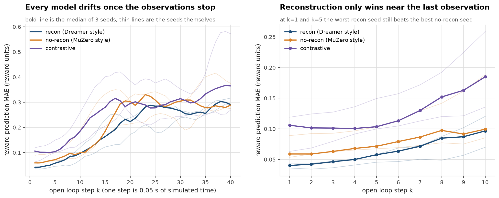
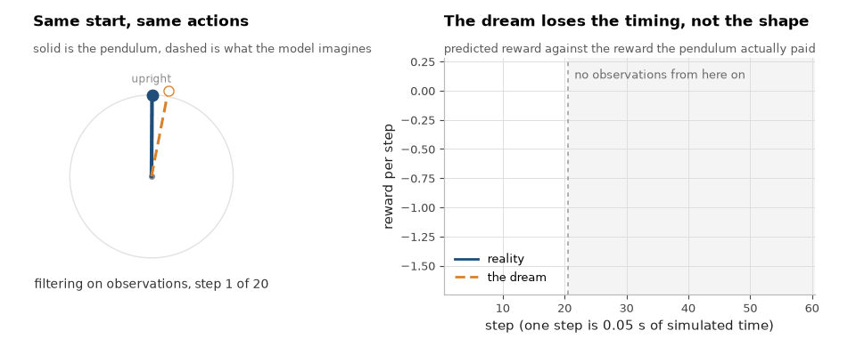
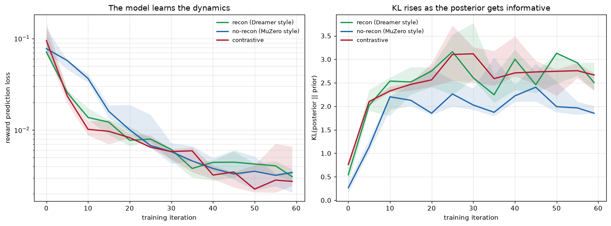
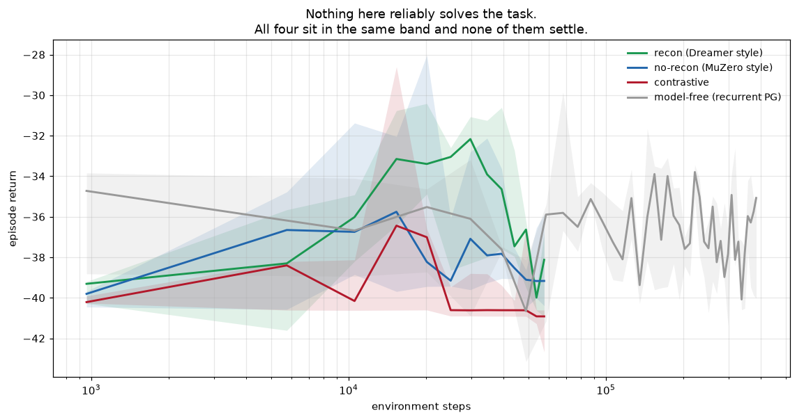

# world-model-from-scratch

[](https://github.com/aghasalim/world-model-from-scratch/actions/workflows/ci.yml)
[](https://www.python.org/)
[](LICENSE)
[](results/)

An RSSM built from the Dreamer papers, an actor critic trained entirely in
imagination, and the representation ablation that asks whether a world model
needs to reconstruct observations at all.

Two honest halves. **The world model works and the representation question gets a
real answer.** The agent that learns inside it does not: it never reliably solves
the task, and I say so rather than reporting the seed where it looked best.

Everything runs on a laptop CPU in about ten minutes.

## The task

A pendulum swing up where the agent observes only `cos(theta)` and `sin(theta)`.
Angular velocity is hidden.

That is the whole reason the environment is written by hand instead of pulled
from gym. With velocity observed this is a plain MDP and a feedforward policy
solves it, so nothing would test whether the model carries state. Hiding it makes
the task a POMDP: two states with the same angle and opposite velocity produce
an identical observation, and the only way to tell them apart is to remember
where the pendulum was. That is exactly what the recurrent state of an RSSM is
for, and there is a test asserting the ambiguity exists.

## The representation ablation

Dreamer reconstructs observations and pays capacity for it. MuZero style models
reconstruct nothing and predict only what is needed for control. Contrastive
methods sit between. All three are implemented behind one flag, trained
identically, and measured by how far they can roll forward with no observations.



Reward prediction MAE after filtering 20 steps and then predicting open loop,
median over 3 seeds:

| open loop step | recon (Dreamer) | no-recon (MuZero) | contrastive |
|---:|---:|---:|---:|
| 1 | **0.0403** | 0.0589 | 0.1058 |
| 5 | **0.0577** | 0.0716 | 0.1034 |
| 10 | 0.0966 | 0.0995 | 0.1849 |
| 15 | 0.1635 | 0.1843 | 0.2799 |
| 20 | 0.2230 | 0.3029 | 0.2954 |
| 40 | 0.2910 | 0.2884 | 0.3648 |

**Reconstruction helps, and at short horizons the result is clean.** At one step
the three seeds for reconstruction are 0.0360, 0.0403 and 0.0439, and the three
for no-recon are 0.0535, 0.0589 and 0.0889. The worst reconstruction seed beats
the best no-recon seed, so the bands do not overlap. The same holds at k=5:
0.0578 worst against 0.0674 best.

**The advantage is gone by ten steps.** At k=10 recon spans 0.0699 to 0.1203 and
no-recon spans 0.0853 to 0.1883, which overlap, and by k=40 the medians are
0.2910 and 0.2884, indistinguishable. Both have degraded to roughly seven times
their one step error by then.

So the reconstruction signal buys accuracy where the model is still anchored to
recent observations, and buys nothing once the trajectory has drifted. That is a
narrower claim than "Dreamer's decoder is worth it", and it is the one this
experiment supports.



Both pendulums start from the same twenty observed steps and are driven by the
same action sequence, and after step 20 the model is given nothing. It keeps the
shape of the swing and loses the timing. This is the reconstruction model at
seed 0, showing the episode whose open loop error is the median of the 128 the
numbers above are averaged over.

**Contrastive is worst at every horizon**, which surprised me. Its InfoNCE term
only asks the latent to identify which observation in the batch it corresponds
to, and on a two dimensional observation living on the unit circle that is an
easy discrimination that does not require encoding much. A richer observation
space would probably treat it more kindly.

## The model itself learns



Reward prediction loss falls by roughly fifteen times over training, and the KL
between posterior and prior rises as the posterior becomes informative, which is
the expected shape.

## What did not work
| method | return | range over seeds | env steps |
|---|---:|---|---:|
| recon (Dreamer style) | −38.13 | −40.9 to −36.8 | 57,600 |
| no-recon (MuZero style) | −39.17 | −40.4 to −35.9 | 57,600 |
| contrastive | −40.92 | −42.7 to −40.6 | 57,600 |
| model-free (recurrent PG) | −40.66 | −43.2 to −38.1 | 57,600 |
| model-free, run out to 384,000 steps | −35.08 | −40.0 to −34.9 | 384,000 |

A random policy scores about −38.



Full detail in [notes/METHODS.md](notes/METHODS.md#what-did-not-work).
## What I got wrong
**I set the imagination horizon by copying a number rather than by thinking about the task.** Fifteen steps is standard in Dreamer papers on control suites with different timesteps.

Full detail in [notes/METHODS.md](notes/METHODS.md#what-i-got-wrong).
## Running it

```bash
python -m venv .venv && source .venv/bin/activate
pip install -r requirements.txt
```

```bash
python -m pytest tests/ -q
```

```bash
python -m experiments.main --seeds 0 1 2 --iters 60 --imag-horizon 40 --actor-lr 1e-3 --eval-every 5
```

```bash
python -m bench.figures
```

The sweep takes about ten minutes on an M4 CPU and writes `results/*.csv`. The
three static figures read those files and never re-run an experiment. The
animation is the one exception, because a drifting rollout is not something a
summary file can hold: it retrains the seed 0 world model, which takes about a
minute, and refuses to write itself unless its open loop error still matches the
committed `open-loop.csv` exactly.

## Layout

```
wm/envs.py       the POMDP pendulum, written directly, no simulator dependency
wm/rssm.py       deterministic GRU path, stochastic latent, KL balancing
wm/agent.py      actor critic in imagination, lambda returns, target critic
wm/modelfree.py  recurrent policy gradient baseline, same architecture
wm/buffer.py     sequence replay
experiments/     the sweep and the open loop measurement
tests/           22 tests
```

## Sources

- **Hafner, Lillicrap, Fischer, Villegas, Ha, Lee, Davidson. Learning Latent Dynamics for Planning from Pixels. ICML 2019.** [arXiv:1811.04551](https://arxiv.org/abs/1811.04551) PlaNet, and the RSSM's split of the latent into deterministic and stochastic parts.
- **Hafner, Lillicrap, Ba, Norouzi. Dream to Control: Learning Behaviors by Latent Imagination. ICLR 2020.** [arXiv:1912.01603](https://arxiv.org/abs/1912.01603) Dreamer: backpropagating the actor through imagined trajectories.
- **Hafner, Lillicrap, Norouzi, Ba. Mastering Atari with Discrete World Models. ICLR 2021.** [arXiv:2010.02193](https://arxiv.org/abs/2010.02193) DreamerV2. KL balancing, lambda returns and the target critic all come from here.
- **Schrittwieser, Antonoglou, Hubert et al. Mastering Atari, Go, Chess and Shogi by Planning with a Learned Model. Nature 2020.** [arXiv:1911.08265](https://arxiv.org/abs/1911.08265) MuZero: the no-reconstruction position this ablation tests.
- **Laskin, Srinivas, Abbeel. CURL: Contrastive Unsupervised Representations for Reinforcement Learning. ICML 2020.** [arXiv:2004.04136](https://arxiv.org/abs/2004.04136) The contrastive arm.
- **Kaelbling, Littman, Cassandra. Planning and Acting in Partially Observable Stochastic Domains. AI 1998.** Why hiding velocity changes the problem rather than just making it harder.

## Methodology

The rules this follows are in [`METHODOLOGY.md`](METHODOLOGY.md). Rule 14, negative results
stay in, is most of why this file reads the way it does.

## Author

Aghasalim Mustafazada, third year AI student at Howest, Belgium.

<p align="center">
  <a href="https://github.com/aghasalim">
    </a>
  <a href="https://www.kaggle.com/aghasalimmustafazada">
    </a>
  <a href="https://linkedin.com/in/mustafazada">
    </a>
  <a href="https://orcid.org/0009-0001-8746-4582">
    </a>
</p>

## License

MIT, see [LICENSE](LICENSE).
